<!--
  NOVU_MASTER_PRODUCT_BOOK.md
  ---------------------------------------------------------------------------
  Master produktový, obchodní a technický dokument projektu NOVU Builder.
  Určeno pro export do PDF (Pandoc / Markdown-to-PDF), investorskou
  prezentaci, obchodní brožuru, business plán a interní roadmapu.

  Doporučený export:
    pandoc NOVU_MASTER_PRODUCT_BOOK.md -o NOVU_MASTER_PRODUCT_BOOK.pdf \
      --pdf-engine=xelatex --toc --toc-depth=2 -V geometry:margin=2.2cm \
      -V mainfont="Inter" -V monofont="JetBrains Mono" --highlight-style=tango

  Mermaid diagramy: použij mermaid-filter nebo VS Code "Markdown PDF"
  (Marp / mermaid CLI) pro render diagramů do PDF.
  ---------------------------------------------------------------------------
-->

<div align="center">

# NOVU BUILDER
## AI-Orchestrated Construction Operating System

**Master Product Book**
*Produktový · Obchodní · Technický whitepaper*

---

| | |
|---|---|
| **Verze dokumentu** | 1.0 |
| **Verze produktu** | v0.8.3 (pilot-capable) |
| **Datum** | 21. června 2026 |
| **Klasifikace** | Důvěrné — investor / zákazník / CTO |
| **Status produktu** | Pilot Execution Phase |
| **Autor** | NOVU Builder — produktový a inženýrský tým |

---

*Tento dokument je živý. Je verzován v Git repozitáři projektu a aktualizován s každým release.*

</div>

\newpage

## Obsah

1. [Executive Summary](#1-executive-summary)
2. [Product Vision](#2-product-vision)
3. [Market Problem](#3-market-problem)
4. [Why Construction Needs NOVU](#4-why-construction-needs-novu)
5. [Product Positioning](#5-product-positioning)
6. [Mission · Vision · Strategic Objectives](#6-mission--vision--strategic-objectives)
7. [System Overview](#7-system-overview)
8. [Architecture Overview](#8-architecture-overview)
9. [Backend Architecture](#9-backend-architecture)
10. [Workflow Engine](#10-workflow-engine)
11. [State Machine](#11-state-machine)
12. [Event-Driven Design](#12-event-driven-design)
13. [Domain Model](#13-domain-model)
14. [Business Logic Layer](#14-business-logic-layer)
15. [Security Layer](#15-security-layer)
16. [Audit Layer](#16-audit-layer)
17. [Permissions Layer](#17-permissions-layer)
18. [API Layer](#18-api-layer)
19. [AI Readiness](#19-ai-readiness)
20. [AI Agent Architecture](#20-ai-agent-architecture)
21. [Future AI Opportunities](#21-future-ai-opportunities)
22. [Complete Construction Lifecycle](#22-complete-construction-lifecycle)
23. [Business Value](#23-business-value)
24. [Competitive Analysis](#24-competitive-analysis)
25. [Technical Audit — Current State Assessment](#25-technical-audit--current-state-assessment)
26. [Beta Readiness Report](#26-beta-readiness-report)
27. [What Is Missing Before Beta](#27-what-is-missing-before-beta)
28. [What Is Missing Before Production](#28-what-is-missing-before-production)
29. [CTO Recommendations](#29-cto-recommendations)
30. [Investor Section](#30-investor-section)
31. [Roadmap](#31-roadmap)
32. [Appendix — Glossary & References](#32-appendix--glossary--references)

\newpage

---

# 1. Executive Summary

**NOVU Builder** je AI-orchestrovaný operační systém pro stavební a opravárenské firmy. Nejde o další CRM ani o tabulkovou kalkulačku. Je to platforma, která bere **fotografie a parametry zakázky** a server-side je proměňuje v **kompletní strukturovanou nabídku** — s rozpoznáním typu práce, odhadem ploch, návrhem rozsahu prací, materiálů, cenotvorbou a auditovatelným záznamem celého procesu.

Zatímco trh stavebního softwaru se dělí na dvě skupiny — generické nástroje na řízení úkolů (Monday, Asana, ClickUp) a těžké vertikální ERP systémy (Procore, Buildertrend) — žádný z nich neřeší **jádro problému malé a střední stavební firmy: jak rychle, konzistentně a opakovatelně vytvořit přesnou cenovou nabídku.** NOVU Builder tuto mezeru cílí přímo.

## Stav v jedné tabulce

| Dimenze | Stav | Komentář |
|---|---|---|
| **Vývojová fáze** | Pilot Execution | Production-capable platforma čekající na první tenant |
| **Backend** | ~82 % beta-ready | FastAPI, 55 DB migrací, ~1 381 testů (pass), mypy 0 chyb / 126 souborů |
| **Datový model** | Robustní | Work catalog (11 ORM modelů), dva stavové automaty, audit trail, outbox |
| **AI pipeline** | Architektura hotová, modely zapojitelné | Provider-agnostická vrstva (mock / Claude / OpenAI), AI budget governance |
| **Desktop klient** | Pilot-ready | Qt6 + C++ nativní aplikace `NovuBuilder.exe`, build + smoke-check zelené |
| **Bezpečnost** | Audit uzavřen | Multi-tenant izolace, JWT s okamžitou invalidací, rate-limiting, audit log |
| **Nasazení** | Připraveno | Docker Compose, nginx + TLS, MinIO/S3, backup/restore E2E zelené |

## Klíčová zjištění z technického auditu

1. **Backend je výrazně dál než typický MVP.** Systém má produkční rysy, které většina startupů řeší až po Series A: idempotentní zpracování, lease fencing proti duplicitnímu zpracování, poison-job detekci, AI budget rezervace odolné vůči pádu procesu, outbox pattern pro spolehlivé eventy a immutable audit trail.

2. **Architektura předjímá AI, nikoliv ji dodatečně lepí.** Vision analýza je oddělená provider vrstva. Lze přepínat mezi `mock`, `claude_vision_provider` a `openai_vision_provider` bez zásahu do UI nebo databáze. To je strukturální výhoda — produkt je "AI-ready by design".

3. **Multi-tenant SaaS jádro je hotové a otestované**, navržené na 100k+ firem bez kopírování katalogu (sparse tenant overrides).

4. **Hlavní rizika nejsou v jádru, ale na okrajích:** reálné napojení vision modelu na produkční data, dokončení mobilního klienta (Qt for Mobile), a operační zralost (observabilita pod zátěží, škálování workerů).

> **Investorský závěr:** NOVU Builder je technicky vyspělá, defenzivně postavená platforma s jasným tržním klínem (estimace) a vestavěnou AI strategií. Riziko není "umí to fungovat?", ale "jak rychle se zvládne komercializace a onboarding prvních tenantů?".

\newpage

# 2. Product Vision

## Vize jednou větou

> **NOVU Builder promění každou stavební firmu — od jednoho řemeslníka po stavební skupinu — v datově řízenou, AI-asistovanou organizaci, kde od fotky k podepsané nabídce vede přímá, auditovatelná a opakovatelná cesta.**

## Tři pilíře produktové vize

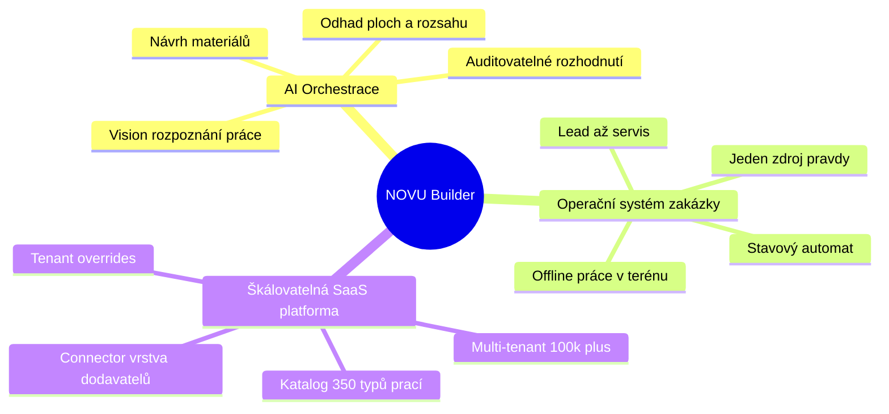

## Od nástroje k operačnímu systému

NOVU Builder není feature, je to **vrstva pod celým provozem firmy**. Stejně jako operační systém abstrahuje hardware, NOVU abstrahuje **chaos stavební zakázky** — roztroušené fotky, papírové poznámky, ceny v hlavě mistra, nabídky v deseti verzích Excelu — do jednoho koherentního, verzovaného, auditovatelného modelu.

| Dnešní realita firmy | Realita s NOVU |
|---|---|
| Nabídka = 3–8 hodin práce mistra | Nabídka = fotky + parametry → minuty |
| Cena "od oka" podle zkušenosti | Cena z katalogu + AI odhadu ploch |
| Znalost odejde s klíčovým člověkem | Znalost je v katalogu a historii zakázek |
| Žádná stopa, proč cena vznikla | Plná lineage: nabídka → analýza → ceník |
| Excel verze `nabidka_final_v7.xlsx` | Immutable archiv s podepsaným manifestem |

\newpage

# 3. Market Problem

## Jádro problému

Stavebnictví je jedním z **nejméně digitalizovaných odvětví** světové ekonomiky. Produktivita ve stavebnictví rostla v posledních dvou dekádách výrazně pomaleji než ve výrobě nebo službách. Příčina není nedostatek softwaru — příčina je, že **existující software neřeší skutečné úzké hrdlo malé a střední firmy: tvorbu nabídky.**

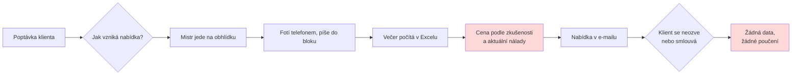

## Pět konkrétních bolestí

1. **Nabídka trvá příliš dlouho.** Kvalifikovaný mistr stráví tvorbou jedné nabídky hodiny. To je čas, který firma neúčtuje a který limituje počet zpracovaných poptávek.

2. **Cena je nekonzistentní.** Stejná práce dostane od dvou lidí (nebo od jednoho ve dvou různých dnech) jinou cenu. Firma neumí garantovat marži.

3. **Znalost je v hlavách.** Jak se počítá zateplení fasády, jaké jsou typické ztráty materiálu, kolik trvá demontáž — to ví "Franta". Když Franta odejde, odejde i firma o polovinu schopností.

4. **Nulová datová stopa.** Proč byla cena 340 000 Kč? Po roce to neví nikdo. Reklamace, spory a opakované zakázky se řeší od nuly.

5. **Žádné učení z historie.** Firma udělá 200 zakázek ročně a nemá z nich žádný strukturovaný datový aktivum, ze kterého by se dalo těžit (predikce, optimalizace, AI).

## Velikost bolesti = velikost příležitosti

| Metrika | Hodnota (ilustrativní, EU SMB segment) |
|---|---|
| Čas na nabídku dnes | 3–8 hodin / nabídka |
| Úspěšnost nabídek (win rate) | typicky 20–35 % |
| Podíl "ztraceného" času na nevyhraných nabídkách | vysoký — práce zdarma |
| Náklad chyby v kalkulaci | přímý zásah do marže projektu |

\newpage

# 4. Why Construction Needs NOVU

Stavebnictví má kombinaci vlastností, která z něj dělá **ideální cíl pro AI-orchestraci**:

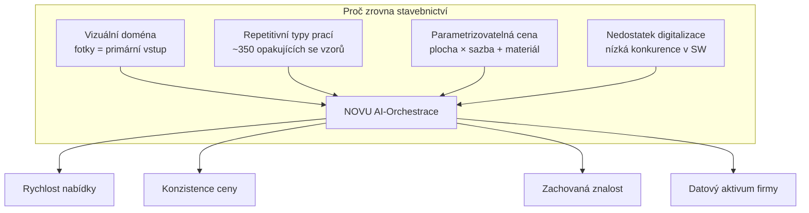

## Čtyři důvody, proč je stavebnictví "AI-shaped"

1. **Vizuální vstup.** Stavební práce se posuzuje očima — z fotky střechy, fasády, balkonu. To je přesně doména, kde dnešní vision modely exceluji. NOVU staví anotační nástroj (polygon na fotce) jako obousměrný kanál mezi člověkem a AI.

2. **Repetitivní vzory.** Přes veškerou rozmanitost je práce klasifikovatelná do ~350 typů v 16 kategoriích (střechy, fasády, komíny, balkony, okna, izolace, zdivo, elektro, voda, topení, FVE…). Jeden typ = konfigurace, ne kód. Pipeline je jedna.

3. **Parametrická cenotvorba.** Cena = plocha/množství × sazba + materiál + marže + DPH. To je deterministicky vyčíslitelné, jakmile AI dodá plochy a rozsah. NOVU má tuto vrstvu (pricing profiles, material catalog, pricebooks) hotovou.

4. **Strukturální nedostatek konkurence.** Velcí hráči (Procore) cílí na velké generální dodavatele. SMB segment je obsloužen Excelem. NOVU má volný prostor.

> **Klíčový insight:** NOVU nedělá z AI gimmick. AI je vsazena do bodu, kde vytváří měřitelnou hodnotu — zkracuje nabídku z hodin na minuty a zároveň generuje datový aktivum, který se s každou zakázkou zhodnocuje.

\newpage

# 5. Product Positioning

## Poziční mapa trhu

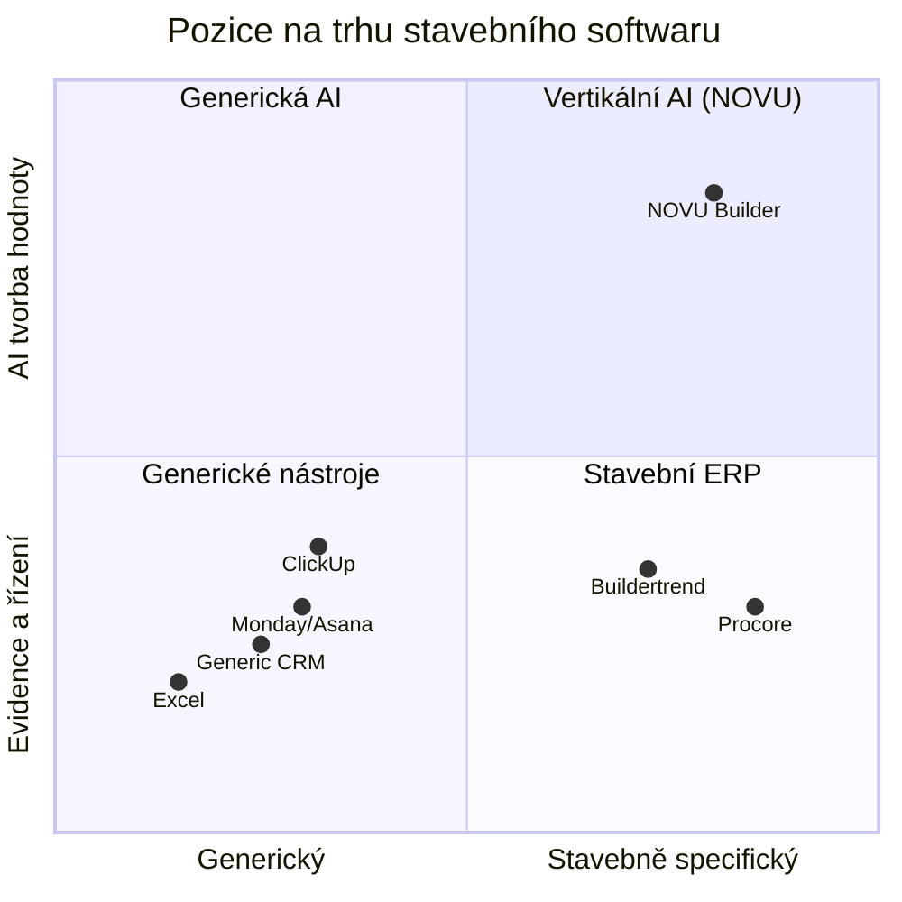

## Poziční výrok

> Pro **malé a střední stavební a opravárenské firmy**, které ztrácejí čas a marži tvorbou nabídek ručně, je **NOVU Builder** AI-orchestrovaný operační systém zakázky, který z fotek a parametrů vytvoří kompletní, auditovatelnou nabídku během minut. Na rozdíl od **generických nástrojů na úkoly** a **těžkých stavebních ERP** se NOVU soustředí na úzké hrdlo — tvorbu hodnoty z vizuálního vstupu — a buduje z něj datový aktivum firmy.

## Co NOVU JE a NENÍ

| NOVU **JE** | NOVU **NENÍ** |
|---|---|
| AI estimační a orchestrační platforma | Účetní systém |
| Operační systém zakázky (lead → servis) | Nástroj na to-do listy |
| Multi-tenant SaaS pro firmy | Jednorázová desktopová licence |
| Nativní desktop + mobil (Qt6/C++) | Webová appka v prohlížeči |
| Zdroj pravdy o tom, jak vzniká cena | Náhrada za stavbyvedoucího |

\newpage

# 6. Mission · Vision · Strategic Objectives

## Mission

> **Dát každé stavební firmě sílu velké organizace** — konzistenci, rychlost a datovou paměť — bez nutnosti najímat oddělení kalkulantů a IT.

## Vision

> **Stát se výchozí vrstvou, na které běží provoz stavebních a opravárenských firem** — od první fotky leadu po poslední servisní výjezd v záruce — s AI jako tichým spolupracovníkem v každém kroku.

## Strategické cíle

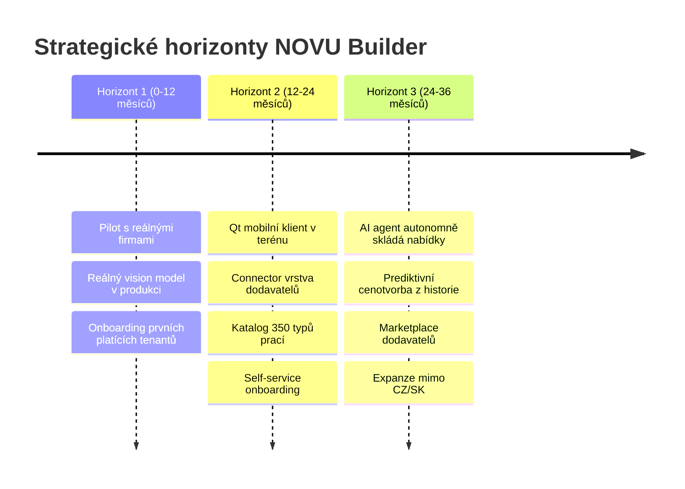

| # | Strategický cíl | Měřitelný výsledek (KPI) |
|---|---|---|
| SC-1 | Validovat hodnotu na reálných firmách | 3–5 platících pilotních tenantů, NPS > 40 |
| SC-2 | Zapojit produkční vision AI | Čas nabídky < 15 min, přesnost ploch v toleranci ±10 % |
| SC-3 | Dokončit terénní mobilní klient | Sběr dat v terénu, offline-first, jedna C++ základna |
| SC-4 | Vybudovat datový moat | > 50 000 zpracovaných zakázek jako trénovací aktivum |
| SC-5 | Dosáhnout opakovatelného onboardingu | Time-to-value nového tenanta < 1 den |

\newpage

# 7. System Overview

NOVU Builder je rozdělený do čtyř logických domén: **klienti**, **backend API**, **asynchronní zpracování (workers)** a **datová + úložná vrstva**.

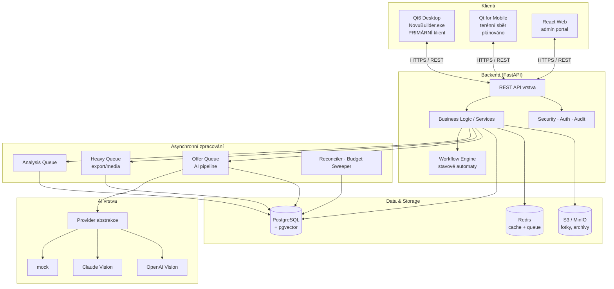

## Co systém dnes prokazatelně umí

| Schopnost | Stav | Důkaz v kódu |
|---|---|---|
| Multi-tenant izolace dat | ✅ | `resolve_org_id()` na endpointech, tenant filtrování v repository |
| Životní cyklus zakázky se stavovým automatem | ✅ | `case_workflow/transitions.py`, migrace 0044 |
| Asynchronní AI analýza s frontou | ✅ | `worker/queue.py`, `analysis_jobs`, lease ownership |
| Provider-agnostická vision analýza | ✅ | `ai/providers/` (mock, claude, openai) |
| Offer pipeline s AI agentem | ✅ | `offer_processing/`, `agent_runs`, outbox |
| AI budget governance (rezervace, sweeper) | ✅ | `offer_processing/budget.py`, migrace 0050/0052 |
| Work catalog 16 kategorií / ~350 typů | ✅ (jádro + seed) | `work_catalog.py`, 11 ORM modelů |
| Cenotvorba (profily, materiály, ceníky) | ✅ | `pricing_profile_service`, `material_catalog`, `pricebooks` |
| Immutable proposal archiv s podpisem | ✅ | v0.8.3 proposal-archive-zip + manifest SHA-256 |
| Měřící lineage (nabídka → analýza → ceník) | ✅ | `analysis_result_id` FK, migrace 0055 |
| Anotace fotek (polygon, scale reference) | ✅ (základ) | `markers`, `measurements`, `ImageOverlayWidget` |
| Audit trail všech operací | ✅ | `audit_logs`, `project_status_history` (immutable) |
| Backup / restore disaster recovery | ✅ | E2E testy 90/90 zelené, DR runbooky |

\newpage

# 8. Architecture Overview

## Architektonické principy

NOVU Builder stojí na pěti návrhových principech, které jsou v kódu skutečně vynucené (ne jen deklarované):

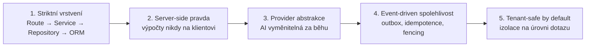

## Vrstvení (z ARCHITECTURE.md)

| Vrstva | Odpovědnost |
|---|---|
| **Route** | validace requestu, autentizace, kontrakt odpovědi |
| **Service** | orchestrace workflow, storage politika, fail-fast chování |
| **Repository** | přístup k DB (tenant-safe) |
| **ORM** | perzistentní model |

Pravidlo úložiště je tvrdě dané: **PostgreSQL je autoritativní relační úložiště, S3 je autoritativní produkční úložiště souborů. Lokální disk je pouze pro DEV/TEST.** Databáze ukládá storage keys, ne veřejné URL.

## Logický pohled na komponenty

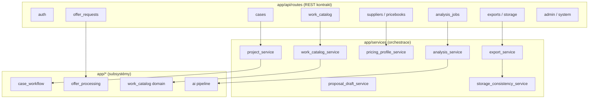

\newpage

# 9. Backend Architecture

Backend je postavený na **FastAPI** (async Python), s jasně oddělenými subsystémy. Následující čísla pocházejí přímo z repozitáře (stav v0.8.3):

| Metrika backendu | Hodnota |
|---|---|
| Alembic migrace | **55** (poslední `0055_add_analysis_result_id_to_final_proposals`) |
| Testovací soubory | **100** |
| Testy (pass / fail) | **~1 381 / 0** (vč. 90 E2E) |
| Statická typová kontrola | mypy **0 chyb / 126 souborů** |
| API route moduly | 18 |
| Service moduly | 17 |
| Repository moduly | 14 |

## Mapa backendových subsystémů

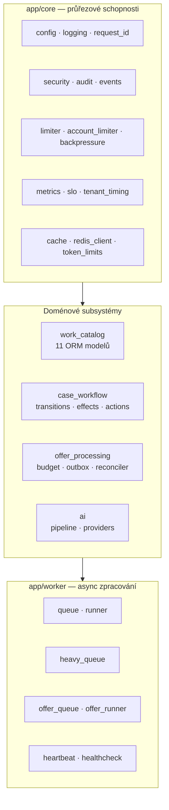

## Asynchronní zpracování — tři oddělené pruhy (lanes)

Kritické architektonické rozhodnutí: **zpracování není jedna fronta, ale tři oddělené pruhy** s vlastními semafory a lease reapery. Těžké operace (export, média) nesmí blokovat rychlou analytickou frontu.

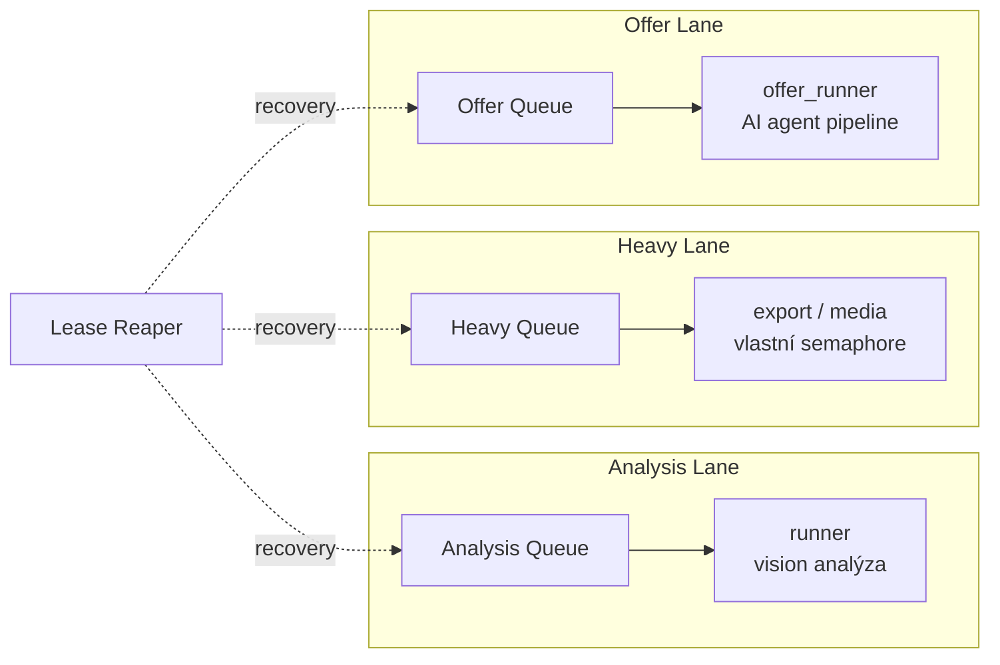

## Odolnost — co backend řeší nad rámec MVP

| Mechanismus | Účel | Soubor |
|---|---|---|
| **Lease fencing** | zabrání dvěma workerům zpracovat stejný job | `offer_runner.py` (`lease_version`) |
| **Poison-job detekce** | po 3 stejných chybách job neretryuje donekonečna | `offer_processing/domain.py` (`POISON_THRESHOLD`) |
| **Retry backoff** | 30s / 120s / 600s pro přechodné chyby | `RETRY_BACKOFF_SECONDS` |
| **AI budget rezervace** | crash-safe rezervace nákladů na AI | `budget.py`, `AiBudgetReservation` |
| **Budget sweeper** | uvolní rezervace zapomenuté po kill -9 | `budget_sweeper.py` |
| **Outbox pattern** | spolehlivé doručení eventů | `outbox.py`, `OutboxEvent` |
| **Reconciler** | dorovnání nekonzistentních stavů | `reconciler.py`, `reconciler_events` |
| **Idempotentní persist** | bezpečné opakování zápisu | migrace 0053 |
| **Backpressure** | ochrana před zahlcením | `core/backpressure.py` |
| **Account limiter** | per-tenant omezení | `core/account_limiter.py` |

\newpage

# 10. Workflow Engine

NOVU Builder má **dva nezávislé workflow enginy**, každý se svým stavovým automatem, transitními pravidly a audit záznamem:

1. **Case Workflow** (`app/case_workflow/`) — životní cyklus zakázky řízený člověkem (manager/superadmin).
2. **Offer Processing** (`app/offer_processing/`) — strojový životní cyklus AI zpracování nabídky.

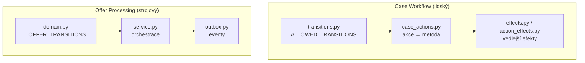

## Návrhové vlastnosti workflow enginu

- **Pure-function guards.** Validace přechodu (`can_transition`, `assert_unlocked`) jsou čisté funkce bez přístupu k DB — testovatelné izolovaně.
- **Worker-only přechody jsou skryté z UI.** Přechod `analyzing → proposal_ready` smí spustit jen worker, nikdy uživatel. `get_available_transitions()` je nikdy nevrací do klienta.
- **Role-based dostupnost akcí.** Technik nevidí žádné akce; manager a superadmin ano (`_MANAGER_ROLES`).
- **Locked statuses.** Ve stavech `{analyzing, proposal_ready, quote_ready, sent}` jsou uploady fotek a editace parametrů odmítnuty — zakázka je „zamčená" proti změnám během zpracování.
- **Immutable history.** Každý přechod zapíše řádek do `project_status_history` (kdo, kdy, z čeho, na co, proč).

\newpage

# 11. State Machine

## Stavový automat zakázky (Case / Project)

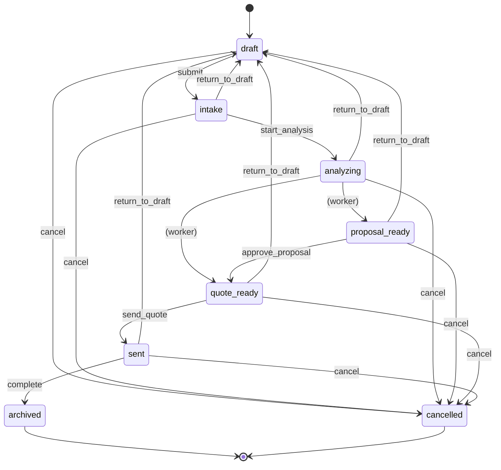

**Zamčené stavy** (žádné editace): `analyzing`, `proposal_ready`, `quote_ready`, `sent`.
**Terminální stavy:** `archived`, `cancelled`.

## Stavový automat zpracování nabídky (Offer)

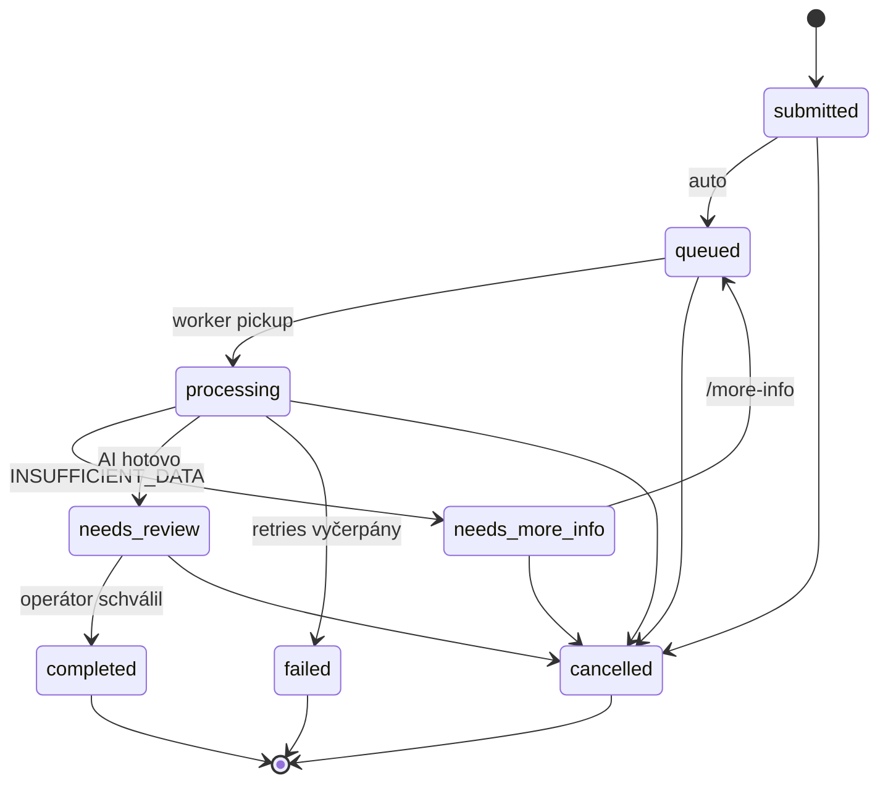

Tento druhý automat je klíčový pro **human-in-the-loop AI**: AI nikdy nepošle nabídku klientovi sama. Po dokončení AI končí ve stavu `needs_review` a čeká na schválení operátorem (pokud není explicitně zapnut `auto_review_bypass`).

\newpage

# 12. Event-Driven Design

NOVU Builder používá **outbox pattern** pro spolehlivé, exactly-once doručení doménových událostí. To je rozdíl mezi „event nám asi proběhl" a „máme garantovaný, auditovatelný záznam každé změny".

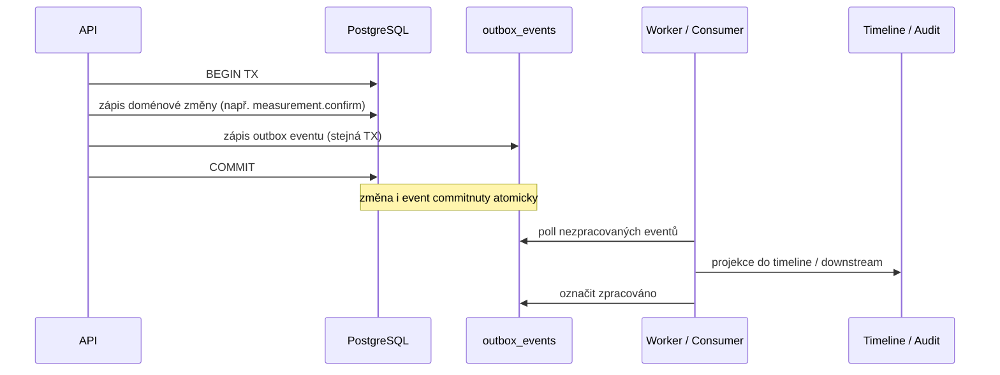

## Příklady doménových událostí

| Event | Kdy vzniká | Kam teče |
|---|---|---|
| `measurement.confirmed` | `POST /measurements/{id}/confirm` | timeline zakázky |
| offer pipeline eventy | přechody offer state machine | reconciler, audit |
| status transitions | každý přechod zakázky | `project_status_history` |
| agent run outcomes | dokončení AI agenta | `agent_runs` |

## Proč to je důležité pro AI

Event-driven jádro znamená, že **každá interakce — lidská i AI — zanechává strukturovanou, dotazovatelnou stopu**. `GET /cases/{id}/timeline` je postavený na reálném dotazu nad outboxem (ne stub). To je přesně ten datový aktivum, který se později stane trénovacím materiálem a auditní evidencí zároveň.

\newpage

# 13. Domain Model

## Pohled na hlavní entity

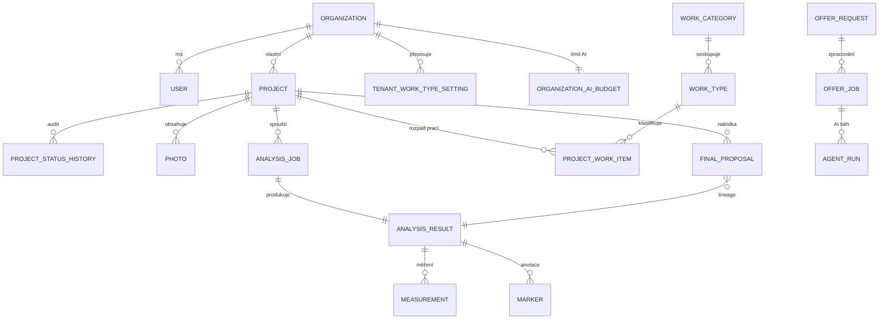

## Work Catalog — srdce domény

Work catalog je **first-class subsystém** s 11 ORM modely. Jeho návrh řeší klíčový škálovací problém: jak nabídnout ~350 typů prací 100 000 firmám, aniž by se katalog kopíroval.

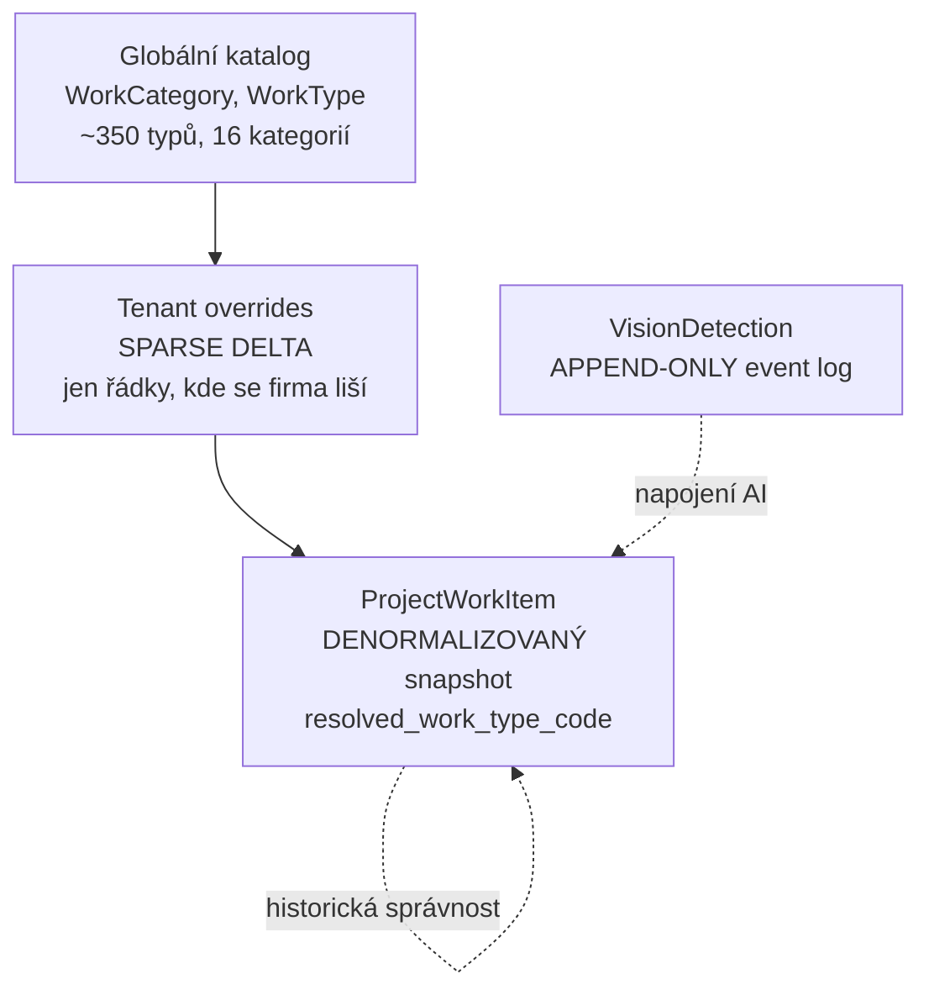

**Tři klíčové vzory:**
- **Sparse override** — tenant ukládá jen rozdíly oproti globálnímu defaultu. 100k tenantů ≠ 100k kopií katalogu.
- **Denormalizovaný snapshot** — `ProjectWorkItem` zmrazí resolved hodnoty (kód typu, verze katalogu), aby historická zakázka zůstala správná i po změně katalogu.
- **Append-only log** — `VisionDetection` je čistý event log (bez `updated_at`), připravený na napojení reálné vision AI.

## 16 kategorií prací

| # | Kategorie | ~ | # | Kategorie | ~ |
|---|---|---|---|---|---|
| 1 | Střechy | 35 | 9 | Fotovoltaika / Energo | 15 |
| 2 | Fasády | 30 | 10 | Elektro | 20 |
| 3 | Komíny | 15 | 11 | Voda / Kanalizace | 20 |
| 4 | Balkony / Terasy | 20 | 12 | Topení / HVAC | 20 |
| 5 | Okna / Dveře | 20 | 13 | Interiéry | 20 |
| 6 | Izolace | 20 | 14 | Základy / Zemní práce | 20 |
| 7 | Zdivo / Beton | 20 | 15 | Speciální konstrukce | 15 |
| 8 | Doplňky / Ostatní | 40 | 16 | Servis / Revize / Diagnostika | 25 |

Každý typ je buď **leaf** (samostatný, např. čištění střechy) nebo **composite** (skládá se z leaf typů, např. rekonstrukce střechy = demontáž + oprava krovu + krytina + okap).

\newpage

# 14. Business Logic Layer

Business logika žije ve **service vrstvě** (`app/services/`) a v **doménových subsystémech**. Route vrstva je tenká — pouze validace a kontrakt. Veškerá orchestrace, storage politika a fail-fast chování patří do services.

## Mapa služeb

| Služba | Odpovědnost |
|---|---|
| `project_service` | životní cyklus zakázky, orchestrace přechodů |
| `analysis_service` | spuštění a zpracování AI analýzy |
| `analysis_profile_service` | profily analýzy (jak se co analyzuje) |
| `proposal_draft_service` | koncept nabídky, patchování |
| `pricing_profile_service` | cenotvorba — sazby, marže, DPH |
| `quote_variant_service` | varianty nabídky (např. ekonomická / prémiová) |
| `material_catalog_service` | katalog materiálů |
| `supplier_service` | dodavatelé |
| `pricebook_service` | ceníky |
| `work_catalog_service` | effective resolution typů prací, runtime projekce |
| `tenant_work_type_resolution_service` | rozlišení tenant override vs. globál |
| `export_service` | export zakázky (ZIP, PDF, archiv) |
| `storage_consistency_service` | konzistence DB ↔ S3 |
| `company_service` | správa firem (tenantů) |
| `auth_service` | autentizace, tokeny |
| `photo_service` | správa fotek |

## Příklad: cesta od měření k zmrazené nabídce

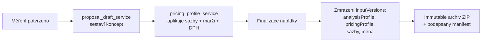

Při finalizaci se **zmrazí všechny vstupní verze** (`inputVersions`) — verze analytického profilu, cenového profilu, konkrétní sazby (hodinová sazba, marže, DPH, měna). To zaručuje, že nabídku lze i po měsících znovu vysvětlit: „takto vypadal ceník a profily v okamžiku finalizace".

\newpage

# 15. Security Layer

Bezpečnostní vrstva prošla **uzavřeným security auditem (2026-04-05)** s verdiktem PILOT-SAFE. Klíčové mechanismy jsou v kódu skutečně vynucené a pokryté testy.

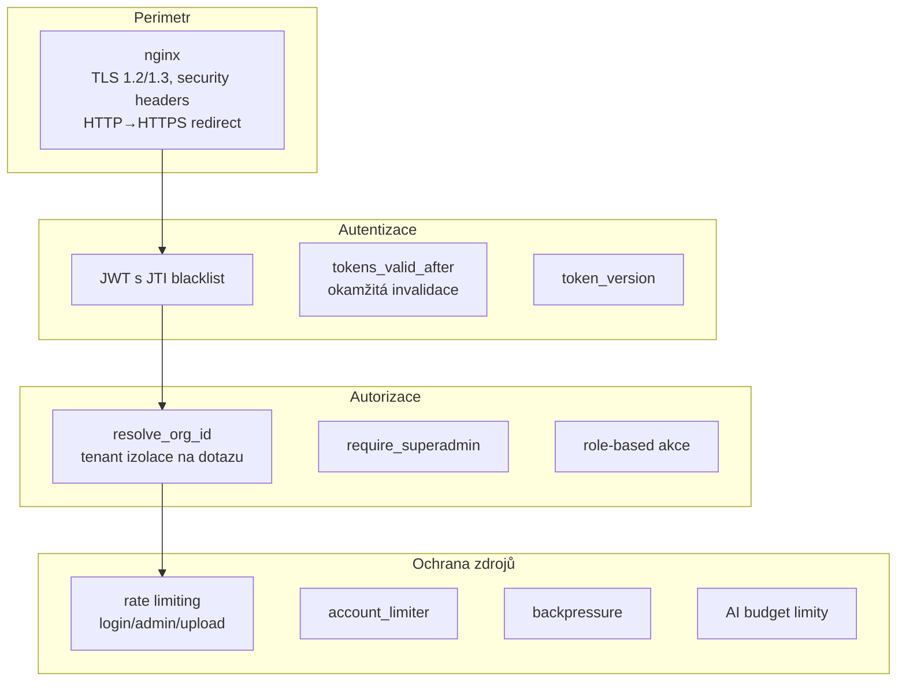

## Klíčové bezpečnostní vlastnosti

| Oblast | Stav | Detail |
|---|---|---|
| Multi-tenant izolace | ✅ Robustní | `resolve_org_id()` na každém endpointu; cross-tenant → 404; 100% pokryto testy |
| JWT autentizace | ✅ Produkční | JTI blacklist + `tokens_valid_after` → okamžitá invalidace po resetu hesla |
| Token versioning | ✅ | `token_version` sloupec (migrace 0040) |
| Admin reset tokenů | ✅ Otestováno | celý flow token → 401 po resetu |
| Redis autentizace | ✅ | `--requirepass`, backend se autentizuje |
| Metriky auth guard | ✅ | Bearer token + nginx IP whitelist |
| Health endpoint split | ✅ | `/alive` (public) / `/health` / `/health/internal` (superadmin + IP) |
| Port 8000 neexponován | ✅ | backend jen přes nginx docker network |
| Rate limiting | ✅ | slowapi, různé limity pro login/admin/upload |
| TLS | ✅ | nginx, pilot self-signed certy (`Generate-PilotCert.ps1`) |
| Security headers | ✅ | X-Frame-Options, X-Content-Type-Options, Referrer-Policy aj. |

> **Pozn. z auditu:** P0 nález (`.env.production` v repu) a P1 (chybějící rate limit na read endpoints) byly evidovány; verdikt PILOT-SAFE s podmínkou. Před produkcí viz sekce 28.

\newpage

# 16. Audit Layer

Auditovatelnost není v NOVU dodatek — je to **strukturální vlastnost**. Existují tři nezávislé, vzájemně se doplňující audit mechanismy:

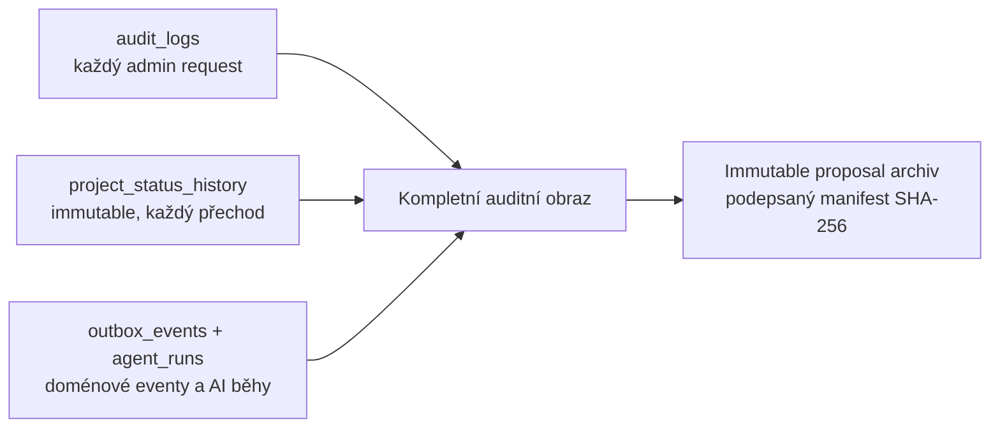

## Tři vrstvy auditu

1. **Administrativní audit** — `audit_logs`, JSONB detail (migrace 0039). Každý admin request je logován; deduplikace pro neautentizované endpointy.

2. **Stavová historie** — `project_status_history` je immutable. Kdo, kdy, z čeho na co, a proč (reason). Nelze přepsat ani smazat běžnou cestou.

3. **Doménové eventy a AI běhy** — `outbox_events` + `agent_runs` zachycují každou doménovou změnu a každý běh AI agenta (vstup, výstup, outcome, model, provider).

## Immutable proposal archiv (v0.8.3)

Při finalizaci nabídky vzniká **deterministický ZIP archiv** s podepsaným manifestem:

| Soubor v archivu | Obsah |
|---|---|
| `proposal_snapshot.json` | kompletní stav nabídky |
| `timeline.json` | časová osa událostí |
| `pricing_snapshot.json` | zmrazené sazby a ceny |
| `manifest.json` | SHA-256 hash každého souboru → detekce manipulace |

ZIP je **byte-identicky reprodukovatelný** (seřazené názvy + ZIP-epoch timestampy). Existuje offline viewer (`/archive-viewer`) a CLI validátor (`scripts/check_archive_integrity.py`, exit kódy 0/1/2). Každý JSON nese `archiveSchemaVersion: 1` — stabilní kontrakt pro budoucí čtečky.

\newpage

# 17. Permissions Layer

Oprávnění jsou řešena na třech úrovních, které se skládají:

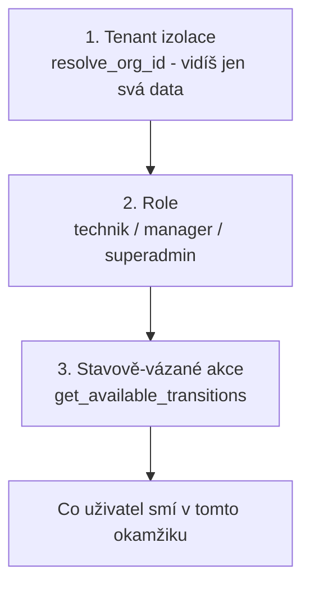

## Role a jejich oprávnění

| Role | Vidí data | Spouští workflow akce | Admin operace | Cross-tenant |
|---|---|---|---|---|
| **Technik** | svého tenanta | ❌ (žádné transition akce) | ❌ | ❌ |
| **Manager** | svého tenanta | ✅ (submit, approve, send…) | částečně | ❌ |
| **Superadmin (NOVU)** | všechny tenanty | ✅ | ✅ (`require_superadmin`) | ✅ |

## Stavově-vázané akce

Klíčová vlastnost: **oprávnění nezávisí jen na roli, ale i na stavu zakázky.** `get_available_transitions(project, role)` vrací jen ty akce, které jsou v daném okamžiku legální. Manager ve stavu `draft` vidí „Submit" a „Cancel"; ve stavu `quote_ready` vidí „Send quote", „Return to draft", „Cancel". To eliminuje celou třídu chyb „nelegální operace".

\newpage

# 18. API Layer

REST API je verzované (`api_versioning.py`) a rozdělené do 18 doménových modulů. Každý nese request-id (`request_id.py`) pro traceability a per-tenant timing (`tenant_timing.py`) pro observabilitu.

## Přehled API domén

```mermaid
flowchart LR
    subgraph "Identita"
        auth[/auth/]
        admin[/admin/]
        system[/system/]
    end
    subgraph "Zakázka"
        cases[/cases/]
        ce[/case-events/]
        img[/images/]
        mark[/markers/]
        meas[/measurements/]
    end
    subgraph "AI & Nabídka"
        aj[/analysis-jobs/]
        est[/estimates/]
        or[/offer-requests/]
        oe[/offer-events/]
    end
    subgraph "Katalog & Ceny"
        wc[/work-catalog/]
        sup[/suppliers/]
        pb[/pricebooks/]
        mc[/material-catalog/]
    end
    subgraph "Výstupy"
        exp[/exports/]
        st[/storage/]
    end
```

## Návrhové vlastnosti API

| Vlastnost | Detail |
|---|---|
| **Verzování** | `/api/v1/...`, dedikovaný `api_versioning` modul |
| **Request tracing** | každý request má `request_id`, propaguje se do logů |
| **Cursor pagination** | seznamy stránkovány kurzorem (ne offset) — stabilní pod zápisy |
| **Tenant timing** | per-tenant latence pro detekci „hlučného souseda" |
| **Health split** | `/alive`, `/health`, `/health/internal` |
| **Cache** | Redis cache na hot-path (work catalog TTL 60s) |
| **Fail-fast** | strict env validace při startu (56 REQUIRED-STRICT polí) |

\newpage

# 19. AI Readiness

Toto je strategicky nejdůležitější kapitola. **NOVU Builder není „aplikace, do které půjde někdy přidat AI". Je to systém, jehož architektura je kolem AI postavená — a AI je dnes zapojitelná přepnutím jediné konfigurace.**

## Provider abstrakce

```mermaid
flowchart TB
    ROUTE[API route /analysis-jobs] --> SVC[ai/analysis_service.py]
    SVC --> PIPE[ai/pipeline.py<br/>PipelineOrchestrator<br/>stage contracts]
    PIPE --> ABST{AI_ANALYSIS_PROVIDER}
    ABST -->|mock| MOCK[mock_vision_provider<br/>deterministický, pro testy]
    ABST -->|claude| CLA[claude_vision_provider]
    ABST -->|openai| OAI[openai_vision_provider]
    MOCK & CLA & OAI --> OUT[Jednotný výstupní kontrakt]
    OUT --> PERS[Persistence:<br/>analysis_jobs + analysis_results]
```

## Jednotný výstupní kontrakt provideru

Každý provider — bez ohledu na model za ním — vrací **stejný objekt**. To je ten architektonický trik, který dělá AI vyměnitelnou bez dopadu na zbytek systému:

| Pole | Význam |
|---|---|
| `providerKey` | který provider odpověděl |
| `jobType` | rozpoznaný typ práce |
| `objectType` | typ objektu (střecha, fasáda…) |
| `surfaceCondition` | stav povrchu |
| `recommendedScope` | doporučený rozsah prací |
| `estimatedAreaSqm` | odhadnutá plocha v m² |
| `areaConfidence` | spolehlivost odhadu |
| `maskPolygon` | maska / polygon detekce |
| `materials` | navržené materiály |
| `workflow` | doporučený pracovní postup |
| `modelName`, `modelVersion` | provenance — který model, jaká verze |

## Co dělá NOVU „AI-ready"

| Faktor | Proč je to výhoda |
|---|---|
| **Provider abstrakce** | model lze vyměnit (mock → Claude → OpenAI) bez zásahu do UI/DB |
| **Multi-pipeline orchestrátor** | různé typy prací mohou mít různé analytické pipeline |
| **Stage contracts** | jasné kontrakty mezi fázemi analýzy |
| **AI budget governance** | náklady na AI jsou rezervované, sweepované, limitované per-tenant |
| **Append-only vision log** | každá detekce je zaznamenaná → trénovací data |
| **Human-in-the-loop** | AI končí v `needs_review`, člověk schvaluje |
| **Provenance v každém výstupu** | `modelName/Version` zmrazené v záznamu |

> **Důležité upřesnění (poctivost):** Reálné vision modely jsou dnes zapojené jako **integrační body** (`mock` je plně funkční a deterministický, `claude`/`openai` providery jsou připravené). Plné produkční napojení reálného modelu na reálná data je první krok H1 roadmapy. **Hodnota není v tom, že model už běží — hodnota je v tom, že systém je na něj připravený a nebude se kvůli němu přestavovat.**

\newpage

# 20. AI Agent Architecture

Offer pipeline (`app/offer_processing/`) je **agentní jádro** NOVU. Zpracovává požadavek na nabídku jako autonomní, ale auditovaný a rozpočtově řízený běh.

```mermaid
sequenceDiagram
    participant C as Klient
    participant API
    participant OQ as Offer Queue
    participant R as offer_runner
    participant B as Budget
    participant AI as AI Provider
    participant DB

    C->>API: POST /offer-requests
    API->>DB: offer_request (submitted→queued)
    API->>OQ: zařadit job
    R->>OQ: dequeue
    R->>DB: mark_running + lease_version (Phase 1)
    R->>B: reserve(job_id) — crash-safe rezervace
    Note over R,AI: Phase 2 — žádné DB spojení drženo
    R->>AI: vision + reasoning (10–60 s)
    AI-->>R: AgentRun outcome
    R->>DB: fencing check (lease_version) + persist (Phase 3)
    alt outcome = offer_generated
        R->>B: record_actual — skutečný náklad
        R->>DB: offer → needs_review
    else outcome = insufficient_data
        R->>DB: offer → needs_more_info
    else error (retryable)
        R->>B: release — vrátit rezervaci
        R->>DB: retry s backoff (30/120/600s)
    end
```

## Tři fáze běhu (řeší pool starvation)

Architektonický detail, který odlišuje seniorní návrh: **AI volání (10–60 s) se nesmí dít s drženým DB spojením.** Proto je běh rozdělen:

1. **Phase 1** — otevři session → fetch + mark running → získej `lease_version` → **zavři session**.
2. **Phase 2** — AI volání (žádné DB spojení drženo).
3. **Phase 3** — otevři session → fencing check → persist → commit → zavři.

## Agentní outcomes a chybové kódy

| Outcome | Význam | Následek |
|---|---|---|
| `offer_generated` | AI úspěšně sestavila nabídku | → `needs_review` |
| `insufficient_data` | chybí vstupy | → `needs_more_info` |
| `error` | technická chyba | retry / fail |
| `cancelled` | zrušeno | terminál |

| Chybový kód | Retryable? |
|---|---|
| `PROVIDER_TIMEOUT` | ✅ |
| `PROVIDER_RATE_LIMITED` | ✅ |
| `PROVIDER_UNAVAILABLE` | ✅ |
| `VALIDATION_FAILED` | ❌ |
| `SNAPSHOT_BUILD_FAILED` | ❌ |
| `BUDGET_EXHAUSTED` | ❌ |

## AI Budget governance

```mermaid
flowchart LR
    REQ[Job start] --> RES[reserve<br/>atomický counter + řádek]
    RES --> RUN[AI běh]
    RUN -->|úspěch| ACT[record_actual<br/>skutečný náklad]
    RUN -->|chyba| REL[release<br/>vrátit kredit]
    RUN -->|kill -9| SW[BudgetSweeper<br/>expiruje zapomenuté rezervace]
    ACT & REL & SW --> BUD[(organization_ai_budgets)]
```

Tohle je **enterprise-grade FinOps pro AI**, který má jen málokterý startup: každý tenant má rozpočet, rezervace přežije pád procesu a sweeper uklidí osiřelé rezervace. Náklady na AI jsou tak pod kontrolou per-firma.

\newpage

# 21. Future AI Opportunities

Architektura otevírá širokou expanzní plochu. Následující příležitosti jsou seřazené podle blízkosti k současnému stavu.

```mermaid
flowchart TB
    NOW[Dnešní jádro:<br/>provider abstrakce, agent pipeline,<br/>vision log, budget governance]
    NOW --> O1[Reálný vision model<br/>segmentace + odhad ploch]
    NOW --> O2[RAG nad historií zakázek<br/>pgvector embeddingy]
    O1 --> O3[Prediktivní cenotvorba<br/>z 50k+ zakázek]
    O2 --> O4[Asistent nabídek<br/>návrh textu, rizik, alternativ]
    O3 --> O5[Autonomní agent<br/>fotka → kompletní nabídka<br/>bez ručního kroku]
    O4 --> O5
    O5 --> O6[Marketplace + dynamické ceny<br/>od dodavatelů]
```

## Konkrétní příležitosti

| Příležitost | Co umožní | Předpoklad v architektuře |
|---|---|---|
| **Reálný vision model** | automatický odhad ploch z fotek | provider abstrakce hotová |
| **RAG nad historií** | „podobné zakázky v minulosti stály X" | pgvector zvolen, vision log existuje |
| **Prediktivní cenotvorba** | cena z reálných dat, ne z odhadu | strukturovaný datový aktivum |
| **Asistent nabídek (LLM)** | generování textu nabídky, upozornění na rizika | offer pipeline, agent_runs |
| **Plně autonomní agent** | od fotky po nabídku bez ručního kroku | human-in-the-loop lze postupně rozvolňovat |
| **Detekce anomálií** | „tato cena je o 40 % mimo obvyklou" | timeline + lineage data |
| **Multimodální vstup** | hlasový popis technika + fotky | provider kontrakt rozšiřitelný |

> **Datový moat se buduje od první zakázky.** Každá zpracovaná zakázka — s fotkami, anotacemi, potvrzenými měřeními, finální cenou a outcomem — je strukturovaný trénovací příklad. Po 50 000 zakázkách má NOVU aktivum, které konkurence nedokáže rychle dohnat.

\newpage

# 22. Complete Construction Lifecycle

NOVU Builder pokrývá **celý životní cyklus zakázky** — od prvního kontaktu po servis v záruce. Žádný jiný nástroj v segmentu SMB nepokrývá tento rozsah v jednom datovém modelu.

```mermaid
flowchart LR
    L[Lead] --> A[Analysis] --> P[Proposal] --> C[Contract] --> E[Execution] --> R[Reporting] --> W[Warranty] --> S[Service]
    S -.->|repeat business| L
    style L fill:#e3f2fd
    style A fill:#e8f5e9
    style P fill:#fff3e0
    style C fill:#f3e5f5
    style E fill:#e0f7fa
    style R fill:#fce4ec
    style W fill:#f1f8e9
    style S fill:#fff8e1
```

## Fáze po fázi

### 1. Lead
Příchozí poptávka. Vznik zakázky ve stavu `draft`. Sběr základních parametrů a prvních fotek (desktop nebo terénní mobil).

| Stav | Pokrytí dnes |
|---|---|
| `draft → intake` | ✅ stavový automat |

### 2. Analysis
Fotky + parametry → AI vision analýza. Stav `intake → analyzing`. Worker zpracuje job, vrátí typ práce, plochy, rozsah, materiály.

| Schopnost | Pokrytí |
|---|---|
| Async fronta analýzy | ✅ |
| Provider abstrakce | ✅ |
| Anotace (polygon, scale) | ✅ základ |
| Reálný vision model | 🔶 H1 |

### 3. Proposal
Z analýzy se sestaví koncept nabídky, aplikuje se cenotvorba. Stav `analyzing → proposal_ready`.

| Schopnost | Pokrytí |
|---|---|
| proposal_draft + patching | ✅ |
| pricing profiles, varianty | ✅ |
| AI agent (offer pipeline) | ✅ |

### 4. Contract
Schválení nabídky a odeslání klientovi. Stav `proposal_ready → quote_ready → sent`. Immutable archiv s podpisem.

| Schopnost | Pokrytí |
|---|---|
| approve + send workflow | ✅ |
| immutable archiv + manifest | ✅ |
| e-podpis / smlouva | 🔶 budoucí |

### 5. Execution
Realizace prací. Stav `sent`. (Rozvoj: pracovní výkazy, fotodokumentace průběhu.)

| Schopnost | Pokrytí |
|---|---|
| work items rozpad | ✅ |
| terénní fotodokumentace | 🔶 mobil H2 |

### 6. Reporting
Dokončení a uzavření. Stav `sent → archived`. Timeline, lineage, archiv.

| Schopnost | Pokrytí |
|---|---|
| timeline z outboxu | ✅ |
| lineage nabídka → analýza | ✅ |

### 7. Warranty
Záruční evidence. (Rozvoj: záruční lhůty, připomínky.)

| Schopnost | Pokrytí |
|---|---|
| archiv jako základ | ✅ |
| záruční modul | 🔶 v2.0 |

### 8. Service
Servisní výjezdy, revize, diagnostika. Kategorie 16 katalogu (Servis/Revize/Diagnostika ~25 typů) je na to připravená. Servis generuje nové leady → cyklus se uzavírá.

| Schopnost | Pokrytí |
|---|---|
| servisní typy v katalogu | ✅ |
| servisní workflow | 🔶 v2.0 |

\newpage

# 23. Business Value

## ROI — kde vznikají peníze

```mermaid
flowchart LR
    subgraph "Úspora času"
        T1[Nabídka 3-8h → minuty] --> ROI
    end
    subgraph "Ochrana marže"
        M1[Konzistentní cena<br/>z katalogu] --> ROI
        M2[Žádné chyby v kalkulaci] --> ROI
    end
    subgraph "Více zakázek"
        V1[Více zpracovaných poptávek<br/>za stejný čas] --> ROI
    end
    subgraph "Zachovaná znalost"
        Z1[Nezávislost na klíčových lidech] --> ROI
    end
    ROI[Návratnost investice]
```

## Modelový výpočet ROI (ilustrativní)

| Položka | Bez NOVU | S NOVU |
|---|---|---|
| Čas na nabídku | 5 hod | 20 min |
| Nabídek / měsíc / kalkulant | ~20 | ~80+ |
| Konzistence ceny | nízká | vysoká |
| Chybovost kalkulace | běžná | minimalizovaná |
| Datová stopa | žádná | kompletní |

Pokud kalkulant zvládne **4× více nabídek** za stejný čas a každá vyhraná zakázka má vyšší a chráněnou marži, návratnost předplatného je řádově **týdny**, ne měsíce.

## Čtyři osy hodnoty

| Osa | Mechanismus | Dopad |
|---|---|---|
| **Automatizace** | AI z fotek odvodí typ, plochy, rozsah | méně ruční práce |
| **Úspory** | rychlejší nabídka, méně chyb | nižší náklad na nabídku |
| **Škálovatelnost** | multi-tenant, katalog jako konfigurace | růst bez lineárního růstu nákladů |
| **Konkurenční výhoda** | datový moat, rychlost reakce na poptávku | vyšší win rate |

\newpage

# 24. Competitive Analysis

## Srovnávací matice

| Kritérium | Excel | Generic CRM | ERP | Monday | Asana | ClickUp | Buildertrend | Procore | **NOVU** |
|---|---|---|---|---|---|---|---|---|---|
| Stavebně specifické | ❌ | ❌ | 🔶 | ❌ | ❌ | ❌ | ✅ | ✅ | ✅ |
| AI vision analýza | ❌ | ❌ | ❌ | ❌ | ❌ | ❌ | ❌ | ❌ | ✅ |
| Tvorba nabídky z fotek | ❌ | ❌ | ❌ | ❌ | ❌ | ❌ | 🔶 | 🔶 | ✅ |
| Katalog typů prací | ❌ | ❌ | 🔶 | ❌ | ❌ | ❌ | 🔶 | ✅ | ✅ |
| Cílí SMB segment | ✅ | ✅ | ❌ | ✅ | ✅ | ✅ | 🔶 | ❌ | ✅ |
| Auditovatelná lineage | ❌ | 🔶 | ✅ | ❌ | ❌ | ❌ | 🔶 | ✅ | ✅ |
| Nativní desktop + mobil | 🔶 | ❌ | 🔶 | ❌ | ❌ | ❌ | 🔶 | 🔶 | ✅ |
| Offline práce v terénu | 🔶 | ❌ | ❌ | ❌ | ❌ | ❌ | 🔶 | 🔶 | ✅ |
| Cena pro malou firmu | ✅ | 🔶 | ❌ | 🔶 | 🔶 | 🔶 | ❌ | ❌ | ✅ |

Legenda: ✅ ano · 🔶 částečně / s omezením · ❌ ne

## Pozičně po skupinách

```mermaid
flowchart TB
    subgraph "Tabulky"
        EX[Excel<br/>levné, flexibilní<br/>ale: chaos, žádná AI, žádná data]
    end
    subgraph "Generické nástroje"
        GEN[Monday / Asana / ClickUp / CRM<br/>dobré na úkoly<br/>ale: nevědí nic o stavebnictví]
    end
    subgraph "Těžké ERP"
        ERP[Procore / Buildertrend / ERP<br/>komplexní, drahé<br/>cílí velké hráče, ne SMB]
    end
    subgraph "NOVU klín"
        N[NOVU Builder<br/>vertikální AI estimace<br/>pro SMB segment]
    end
```

## Proč NOVU vyhrává v segmentu

- **Vs. Excel:** Excel je „nepřítel č. 1", ale neumí AI, nemá datovou paměť ani audit. NOVU dává rychlost Excelu + inteligenci a stopu.
- **Vs. generické nástroje:** Monday/Asana/ClickUp řídí úkoly, ale **nevytvářejí hodnotu z vizuálního vstupu**. Neumějí spočítat nabídku.
- **Vs. ERP (Procore/Buildertrend):** cílí velké generální dodavatele, jsou drahé a komplexní. SMB firma je nepoužije. NOVU je postaveno pro ně.

\newpage

# 25. Technical Audit — Current State Assessment

Tato kapitola je **střízlivé hodnocení**, ne marketing. Vychází z přímé analýzy repozitáře.

## Silné stránky

```mermaid
mindmap
  root((Silné stránky))
    Zralý backend
      55 migrací
      1381 testů pass
      mypy 0 chyb
    Odolnost nad MVP
      lease fencing
      poison detekce
      outbox pattern
      idempotence
    AI-ready architektura
      provider abstrakce
      multi-pipeline
      budget governance
    SaaS jádro
      multi-tenant izolace
      sparse overrides
      škálovatelný katalog
    Auditovatelnost
      immutable history
      podepsaný archiv
      lineage
```

| # | Silná stránka | Důkaz |
|---|---|---|
| S1 | Vysoká testová a typová disciplína | ~1 381 testů, mypy 0/126 |
| S2 | Produkční odolnostní vzory | fencing, poison, outbox, reconciler, sweeper |
| S3 | AI-ready provider architektura | 3 providery za jedním kontraktem |
| S4 | Robustní multi-tenant izolace | `resolve_org_id`, 100% test coverage izolace |
| S5 | Auditovatelnost a lineage | immutable history, podepsaný archiv |
| S6 | Oddělené zpracovací pruhy | analysis / heavy / offer lanes |
| S7 | Nativní výkonný klient | Qt6/C++, ~50–150 MB RAM vs. Electron 300–600 MB |
| S8 | Připravené nasazení | Docker, nginx+TLS, MinIO/S3, DR runbooky |

## Slabé stránky

| # | Slabá stránka | Dopad |
|---|---|---|
| W1 | Reálný vision model zatím není v produkci | hlavní hodnotová smyčka běží na mocku |
| W2 | Mobilní klient (Qt) zatím neexistuje | terénní sběr dat chybí (React Native zmražen) |
| W3 | `ApiService` v Qt byl monolitický (split rozpracován) | technický dluh klienta (částečně řešen v0.8.3) |
| W4 | Connector vrstva dodavatelů chybí | ceníky se zatím nesynchronizují automaticky |
| W5 | Admin UI v React webu je omezené | správa tenantů/katalogu zatím náročnější |
| W6 | Observabilita pod reálnou zátěží neověřena | SLO definováno, ale ne validováno produkčním provozem |

## Technický dluh

| Oblast | Dluh | Priorita |
|---|---|---|
| Qt `ApiService` | dokončit split na doménové API klienty | P1 |
| Vision pipeline | nahradit mock reálným modelem + storage flow | P0 |
| Connector vrstva | `CsvConnector`, `ApiConnector`, `WebhookReceiver` | P1 |
| Annotation tool | rozvinout `ImageOverlayWidget` na plný polygon editor | P1 |
| Work catalog seed | rozšířit z ukázkových typů na plných ~350 | P1 |

## Architektonická rizika

| Riziko | Pravděpodobnost | Dopad | Mitigace |
|---|---|---|---|
| Vision model nedosáhne přesnosti ploch | střední | vysoký | human-in-the-loop + anotace, postupné zpřesňování |
| Náklady na AI vyšší než model počítá | střední | střední | budget governance už existuje, per-tenant limity |
| Škálování workerů při růstu | nízká | střední | oddělené lanes, lease fencing připraveny na horizontální scale |
| Multi-pipeline složitost | nízká | střední | stage contracts, backward-compat zachována |

## Provozní rizika

| Riziko | Mitigace |
|---|---|
| Ztráta dat | DR runbooky, backup/restore E2E 90/90 zelené, restore S3→PG pořadí |
| Únik dat mezi tenanty | izolace na úrovni dotazu + 100% test coverage |
| Výpadek AI providera | retryable chyby + backoff + fallback na `needs_more_info` |
| Zahlcení | backpressure + account limiter + rate limiting |

\newpage

# 26. Beta Readiness Report

Hodnocení připravenosti na **veřejnou beta** (více pilotních tenantů). Procenta jsou expertní odhad na základě stavu repozitáře a uzavřených auditů.

```mermaid
flowchart LR
    subgraph "Beta Readiness Scorecard"
        BE[Backend ........ 82%]
        AP[API ............ 85%]
        SE[Security ....... 80%]
        DE[Deployment ..... 78%]
        TE[Testing ........ 85%]
        OB[Observability .. 65%]
        FE[Frontend ....... 60%]
    end
```

| Oblast | Readiness | Zdůvodnění |
|---|---|---|
| **Backend** | **82 %** | 55 migrací, ~1 381 testů, mypy 0; chybí jen produkční vision model a connector vrstva |
| **API** | **85 %** | verzované, traceable, paginované, health split; stabilní kontrakt |
| **Security** | **80 %** | audit uzavřen (PILOT-SAFE); P1 rate-limit na read endpoints a tajemství mimo repo dořešit |
| **Deployment** | **78 %** | Docker+nginx+TLS+MinIO hotové; chybí ostrá produkční CI/CD a vícestrojové škálování |
| **Testing** | **85 %** | vysoké unit/E2E pokrytí; chybí load/chaos validace pod reálnou zátěží |
| **Observability** | **65 %** | metriky, SLO, per-tenant timing existují; nebyly validovány produkčním provozem; chybí dashboardy/alerting v ostrém běhu |
| **Frontend** | **60 %** | Qt desktop pilot-ready; mobil chybí; React admin portal omezený |

## Celkové hodnocení

> **Vážený průměr ≈ 76 %.** NOVU Builder je **blízko beta-ready**. Backend a API jsou nejsilnější; frontend (zejména mobil) a observabilita pod zátěží jsou hlavní brzdy. Žádná z mezer není architektonická — všechny jsou dokončovací.

\newpage

# 27. What Is Missing Before Beta

Prioritizovaný seznam. **P0 = blokuje beta, P1 = vysoká, P2 = doporučené.**

## P0 — Kritické (blokují beta)

```mermaid
flowchart TB
    P01[Produkční vision model<br/>napojit reálný provider + storage flow]
    P02[End-to-end hodnotová smyčka<br/>fotka → reálná nabídka ověřená na datech]
    P03[Tajemství mimo repo<br/>dořešit .env.production governance]
    P04[Onboarding prvního tenanta<br/>ověřený self-service / asistovaný flow]
    P01 --> P02
    P03 --> P04
```

| ID | Položka | Proč P0 |
|---|---|---|
| P0-1 | Reálný vision provider v produkci (storage → model → výsledek) | bez něj běží jádro na mocku |
| P0-2 | Ověřená E2E hodnotová smyčka na reálných fotkách | důkaz hodnoty pro pilotní firmy |
| P0-3 | Governance tajemství (žádné secrety v repu) | bezpečnostní blokátor |
| P0-4 | Reprodukovatelný onboarding tenanta | nutné pro více firem |

## P1 — Vysoké

| ID | Položka |
|---|---|
| P1-1 | Dokončit Qt `ApiService` split (technický dluh klienta) |
| P1-2 | Rozvinout annotation tool (`ImageOverlayWidget` → plný polygon editor) |
| P1-3 | Rozšířit work catalog seed na plných ~350 typů |
| P1-4 | Connector vrstva dodavatelů (CSV/API/webhook) — alespoň CSV |
| P1-5 | Rate limiting na read endpoints (P1 z security auditu) |
| P1-6 | Observabilita: dashboardy + alerting v ostrém běhu |

## P2 — Doporučené

| ID | Položka |
|---|---|
| P2-1 | Admin UI v React webu — komfortní správa tenantů/katalogu |
| P2-2 | RAG ingestion (video/PDF → pgvector) pro retrieval ve vision |
| P2-3 | Load / chaos test pod reálnou souběžnou zátěží |
| P2-4 | WebSocket notifikace desktop ↔ server (čekání na analýzu) |

\newpage

# 28. What Is Missing Before Production

Detailní checklist pro přechod z beta na **plnou produkci** (GA — General Availability).

## Bezpečnost a compliance

- [ ] Všechna tajemství v secret manageru (ne v repu, ne v plain `.env`)
- [ ] Rate limiting na **všech** endpointech včetně read
- [ ] Penetrační test třetí stranou
- [ ] GDPR: smlouvy o zpracování, data retention politika, právo na výmaz
- [ ] Šifrování citlivých polí at-rest (nad rámec disk encryption)
- [ ] Pravidelná rotace klíčů (JWT_SECRET, S3 keys)
- [ ] Audit log retention + ochrana proti manipulaci (WORM/append-only storage)

## Spolehlivost a škálování

- [ ] Horizontální škálování workerů ověřené pod zátěží (více strojů)
- [ ] Autoscaling fronty podle hloubky queue
- [ ] Multi-AZ / redundance DB (replikace, failover)
- [ ] Load test: cílová souběžnost tenantů a zakázek
- [ ] Chaos test: pád workera, pád DB, výpadek AI providera
- [ ] SLO/SLA definované a měřené (uptime, latence analýzy)
- [ ] Disaster recovery drill v produkčním prostředí (ne jen E2E)

## Observabilita

- [ ] Centralizované logy (structured) + retence
- [ ] Metriky → dashboard (Grafana/ekvivalent)
- [ ] Alerting na SLO breach, frontu, error rate, AI budget
- [ ] Distribuované tracing (request_id už existuje — propojit end-to-end)
- [ ] Per-tenant cost a usage reporting

## Produkt a klient

- [ ] Mobilní klient (Qt for Mobile) v produkční kvalitě
- [ ] Plný annotation editor (polygon, scale, GeoJSON)
- [ ] Connector vrstva dodavatelů (CSV + alespoň 1 API)
- [ ] Work catalog kompletní (~350 typů, oba druhy leaf/composite)
- [ ] Self-service onboarding + billing integrace
- [ ] In-app dokumentace / nápověda

## Provoz a business

- [ ] CI/CD pipeline s blue-green / canary deploymentem
- [ ] Status page + incident komunikace
- [ ] Support proces (SLA na odpověď)
- [ ] Billing / subscription management
- [ ] Onboarding runbook pro nové tenanty

\newpage

# 29. CTO Recommendations

> *Psáno z pohledu zkušeného CTO, který dostal tuto codebase do rukou a má rozhodnout o dalším směru.*

## Celkový verdikt

Tato codebase je **výrazně nadprůměrná pro fázi, ve které projekt je.** Vidím zde inženýrské vzory (outbox, lease fencing, idempotentní persist, budget rezervace odolné vůči pádu), které obvykle potkávám až ve scale-up firmách po sérii incidentů. To znamená dvě věci: (1) technické riziko je nízké, (2) tým rozumí distribuovaným systémům. **Nepřestavoval bych jádro — stavěl bych na něm.**

## Sedm doporučení

```mermaid
flowchart TB
    R1[1. Zapojit reálný vision model TEĎ<br/>všechno ostatní na něm závisí]
    R2[2. Nepřestavovat backend<br/>jádro je zdravé, dokončovat okraje]
    R3[3. Mobil jako H2 prioritu<br/>terén je kde data vznikají]
    R4[4. Investovat do observability<br/>nelze škálovat to, co neměříš]
    R5[5. Datový moat od první zakázky<br/>strukturovat data pro budoucí AI]
    R6[6. Onboarding jako produkt<br/>time-to-value < 1 den]
    R7[7. Bezpečnostní dluh uzavřít před GA<br/>secrety, rate limit, pen test]
    R1 --> R2 --> R3 --> R4 --> R5 --> R6 --> R7
```

### Detailně

1. **Zapojte reálný vision model jako absolutní prioritu.** Celý hodnotový příslib stojí na něm. Architektura je připravená — riziko je v přesnosti, ne v integraci. Začněte s human-in-the-loop a anotacemi, zpřesňujte iterativně.

2. **Nepřestavujte backend.** Pokušení „přepsat to čistě" by tu bylo destruktivní. Jádro je defenzivně navržené. Dokončujte okraje (connector vrstva, seed katalogu, mobil).

3. **Mobilní klient je H2 priorita, ne H3.** Data o zakázce vznikají v terénu. Dokud technik fotí do běžné galerie a přepisuje ručně, ztrácíte kvalitu vstupu pro AI. Qt for Mobile ze sdílené C++ základny je správná volba — drží jednu kódovou bázi.

4. **Observabilita je předpoklad škálování, ne luxus.** SLO a metriky existují, ale nebyly validovány zátěží. Před druhým a třetím tenantem chci dashboardy a alerting v ostrém běhu.

5. **Strukturujte data pro budoucí AI od dne nula.** Append-only vision log a lineage už to dělají správně. Držte tuto disciplínu — za rok je to váš největší aktivum a obranný příkop.

6. **Onboarding je produkt, ne dokument.** Cílový time-to-value nového tenanta < 1 den. Každá hodina onboardingu navíc je tření, které brzdí růst.

7. **Bezpečnostní dluh uzavřete před GA, ne po prvním incidentu.** Secrety mimo repo, rate limit na read endpoints, externí pen test. Žádné z toho není velká práce — ale po incidentu by to stálo důvěru.

\newpage

# 30. Investor Section

## Trh — TAM / SAM / SOM

```mermaid
flowchart TB
    TAM["TAM — Total Addressable Market<br/>Globální stavební & opravárenský software<br/>desítky miliard USD ročně"]
    SAM["SAM — Serviceable Addressable Market<br/>SMB stavební firmy v EU<br/>estimace & řízení zakázek"]
    SOM["SOM — Serviceable Obtainable Market<br/>CZ/SK + DACH SMB segment<br/>realistický cíl prvních 3-5 let"]
    TAM --> SAM --> SOM
    style TAM fill:#e3f2fd
    style SAM fill:#bbdefb
    style SOM fill:#90caf9
```

| Vrstva | Definice | Charakter |
|---|---|---|
| **TAM** | Celosvětový trh stavebního/opravárenského softwaru | desítky miliard USD; rychle rostoucí digitalizací odvětví |
| **SAM** | SMB stavební firmy v EU, segment estimace a řízení zakázek | statisíce firem; nízce digitalizovaný |
| **SOM** | CZ/SK + postupně DACH, prvních 3–5 let | tisíce firem dosažitelných přímým prodejem a self-service |

> *Přesná čísla je vhodné doplnit z aktuálního market sizing reportu před fundraisingem. Struktura TAM/SAM/SOM je zde připravená k naplnění daty.*

## Business model

```mermaid
flowchart LR
    subgraph "Příjmy"
        SUB[SaaS předplatné<br/>per-firma / per-seat]
        USE[Usage-based<br/>AI analýzy / zakázky]
        MKT[Marketplace<br/>provize z dodavatelů]
        ENT[Enterprise tier<br/>custom katalogy, SLA]
    end
    SUB --> REV[Opakující se příjem]
    USE --> REV
    MKT --> REV
    ENT --> REV
```

## Revenue streams

| Proud | Model | Zralost |
|---|---|---|
| **SaaS předplatné** | měsíční/roční per firma nebo seat | primární, H1 |
| **Usage-based AI** | platba za analýzy / zpracované zakázky | H1–H2 |
| **Marketplace dodavatelů** | provize z transakcí přes connector vrstvu | H3 |
| **Enterprise** | custom katalogy, dedikované SLA, on-prem | H2–H3 |

## Škálovatelnost

NOVU je strukturálně škálovatelné, protože **typy prací jsou konfigurace, ne kód, a tenant overrides jsou sparse delta.** Přidání nové firmy nezvyšuje složitost systému; přidání nového typu práce je migrace + seed, ne nová pipeline. Náklady rostou sublineárně s počtem tenantů.

```mermaid
flowchart LR
    T1[1 tenant] --> T100[100 tenantů] --> T100k[100k tenantů]
    T1 -.->|sdílený katalog| CAT[1 globální katalog]
    T100 -.->|sparse overrides| CAT
    T100k -.->|sparse overrides| CAT
```

## Atraktivita investice

| Faktor | Hodnocení |
|---|---|
| Velikost trhu | velký, poddigitalizovaný |
| Technické riziko | nízké (zralá codebase) |
| Diferenciace | vysoká (vertikální AI, ne generický nástroj) |
| Defenzibilita | rostoucí (datový moat) |
| Timing | příznivý (zralost vision modelů) |

## Moat (obranný příkop)

```mermaid
mindmap
  root((Moat))
    Datový příkop
      50k plus zakázek
      strukturovaný trénovací aktivum
      konkurence nedohoní rychle
    Doménový katalog
      350 typů prací
      16 kategorií
      roky kurátorské práce
    Switching cost
      historie zakázek v systému
      naučené tenant overrides
    Technologická hloubka
      AI-ready architektura
      enterprise odolnost
```

## Dlouhodobá vize

> Z estimační platformy → operační systém celého stavebního provozu → datová a AI vrstva celého odvětví. Kdo vlastní data o tom, **jak vzniká cena stavební práce**, vlastní strategickou pozici, na které lze stavět cenotvorbu, financování, pojištění i marketplace.

\newpage

# 31. Roadmap

```mermaid
gantt
    title NOVU Builder — Produktová roadmapa
    dateFormat YYYY-MM
    axisFormat %Y-%m

    section v0.9 (Beta-ready)
    Reálný vision model v produkci     :v09a, 2026-07, 3M
    Onboarding prvního tenanta         :v09b, 2026-07, 2M
    Bezpečnostní dluh (secrety, rate)  :v09c, 2026-08, 2M
    Qt ApiService split dokončen       :v09d, 2026-07, 2M

    section v1.0 Beta
    Annotation editor (polygon)        :v10a, 2026-10, 3M
    Work catalog ~350 typů             :v10b, 2026-10, 3M
    Connector CSV dodavatelé           :v10c, 2026-11, 2M
    Observabilita dashboardy+alerting  :v10d, 2026-10, 2M

    section v1.1
    Qt mobilní klient (terén)          :v11a, 2027-01, 4M
    WebSocket notifikace               :v11b, 2027-01, 2M
    Admin UI React web                 :v11c, 2027-02, 3M

    section v2.0
    RAG nad historií (pgvector)        :v20a, 2027-05, 4M
    Prediktivní cenotvorba             :v20b, 2027-06, 4M
    Servisní + záruční workflow        :v20c, 2027-07, 3M

    section v3.0
    Autonomní AI agent (fotka→nabídka) :v30a, 2027-10, 6M
    Marketplace dodavatelů             :v30b, 2027-11, 5M
    Mezinárodní expanze                :v30c, 2028-01, 6M
```

## Milníky po verzích

### v0.9 — Beta-ready
Reálný vision model v produkci, ověřená E2E hodnotová smyčka, onboarding prvního tenanta, uzavřený bezpečnostní dluh. **Cíl: 1 platící pilotní tenant.**

### v1.0 Beta
Plný annotation editor, kompletní katalog ~350 typů, první connector (CSV), observabilita v ostrém běhu. **Cíl: 3–5 pilotních tenantů, NPS > 40.**

### v1.1
Qt mobilní klient pro terénní sběr (sdílená C++ základna), WebSocket notifikace, komfortní admin UI. **Cíl: terénní sběr dat v produkci.**

### v2.0
RAG nad historií zakázek, prediktivní cenotvorba z reálných dat, servisní a záruční workflow. **Cíl: datový moat aktivní, cena z dat.**

### v3.0
Autonomní AI agent (fotka → kompletní nabídka bez ručního kroku), marketplace dodavatelů, mezinárodní expanze. **Cíl: odvětvová AI vrstva.**

\newpage

# 32. Appendix — Glossary & References

## Glosář

| Termín | Význam |
|---|---|
| **Tenant** | jedna zákaznická firma v multi-tenant SaaS |
| **Work type** | typ práce v katalogu (leaf nebo composite) |
| **Sparse override** | tenant ukládá jen rozdíly oproti globálnímu katalogu |
| **Lease fencing** | mechanismus bránící dvěma workerům zpracovat stejný job |
| **Poison job** | job, který selhává opakovaně se stejnou chybou a nemá smysl ho retryovat |
| **Outbox pattern** | spolehlivé doručení eventů zápisem do tabulky ve stejné transakci |
| **Lineage** | doložitelný řetězec původu (nabídka → analýza → ceník) |
| **Human-in-the-loop** | AI navrhuje, člověk schvaluje |
| **Agent run** | jeden běh AI agenta s vstupem, výstupem a outcomem |
| **Reconciler** | proces dorovnávající nekonzistentní stavy |

## Reference (interní dokumenty repozitáře)

| Dokument | Obsah |
|---|---|
| `ARCHITECTURE.md` | runtime architektura, storage pravidla, vrstvení |
| `PRODUCTION_VERDICT.md` | verdikt produkční připravenosti (PILOT READY) |
| `docs/ai-vision-module.md` | provider abstrakce vision analýzy |
| `docs/work_catalog_core_subsystem.md` | core katalogový subsystém |
| `docs/23_security_audit_2026-04-05.md` | bezpečnostní audit |
| `docs/saas_readiness_audit_2026-04-05.md` | SaaS readiness audit |
| `docs/production-slo-system.md` | SLO systém |
| `CHANGELOG.md` | historie verzí (aktuálně v0.8.3) |
| `app/case_workflow/transitions.py` | stavový automat zakázky |
| `app/offer_processing/domain.py` | stavový automat zpracování nabídky |

## Metodická poznámka

Tento dokument vznikl hloubkovou analýzou repozitáře NOVU Builder ve stavu v0.8.3. Implementované schopnosti jsou doloženy odkazy na konkrétní soubory a migrace. Hodnocení readiness, rizik a roadmapy jsou expertní odhady postavené na tomto stavu — nikoli marketingové projekce. Tam, kde funkce není plně implementována (např. produkční vision model), je to explicitně označeno (🔶) a zařazeno do roadmapy.

---

<div align="center">

**NOVU Builder — AI-Orchestrated Construction Operating System**

*Master Product Book · v1.0 · 2026-06-21*

*Důvěrné. Verzováno v Git. Aktualizováno s každým release.*

</div>
